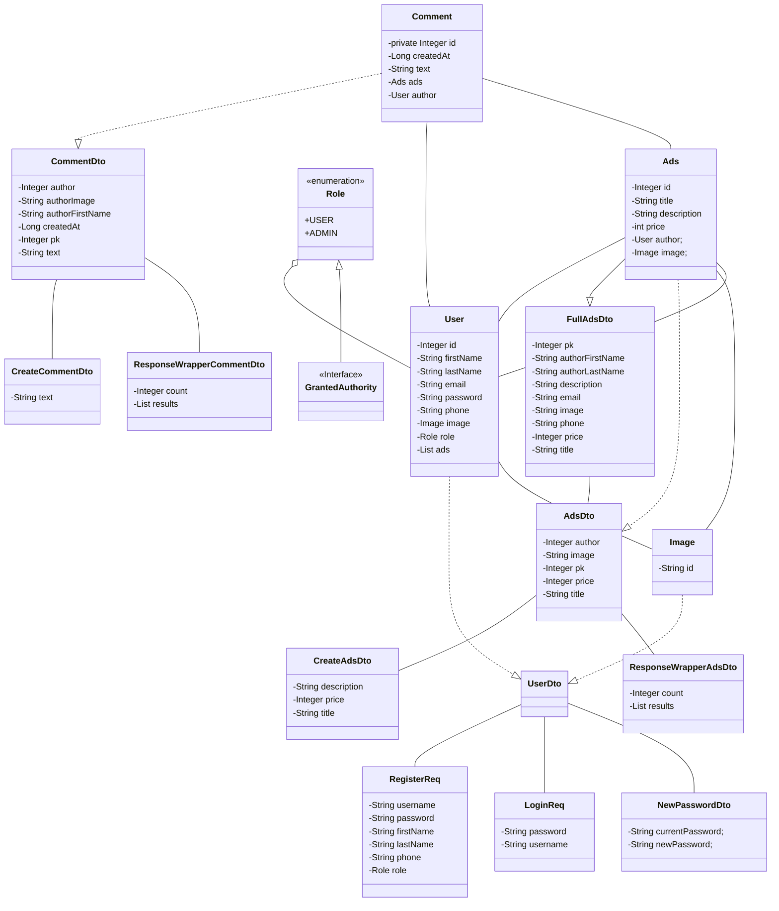

# Информация

## Авторы: 
Максим Сыров ([CatUnderGlue](https://github.com/CatUnderGlue)) 
Ильяс Кучукбаев ([Ilyas344](https://github.com/Ilyas344)) 
Исакова Мария ([profmi2022](https://github.com/profmi2022)) 
Ильдар Губайдуллин ([MexxMo](https://github.com/MexxMo)) 
Андрей Попов ([zalex14](https://github.com/zalex14)) 

## Проект: Наследник Ebay и Avito  
## Старт проекта: 22.05.2023 

## Описание: 
"eBito" - это онлайн-платформа, объединяющая международный маркетплейс eBay и российский
Avito. С помощью eBito пользователи могут покупать и продавать товары и услуги во всем
мире, включая Россию и другие страны, где присутствует eBay. Платформа предлагает широкий
выбор категорий товаров: электроника, мода, спорт, авто и многое другое. eBito обеспечивает
безопасность сделок и защиту покупателей и продавцов, а также предоставляет удобный и
простой интерфейс для использования. С eBito покупки и продажи становятся быстрыми,
удобными и доступными для всех. 

# Запуск приложения
+ Перед запуском приложения _обязательно_ добавьте эти переменные в параметры запуска:
  * db.url = ссылка на подключение к вашей бд
  * db.user = ваш пользователь бд
  * db.password = ваш пароль от бд
+ Загрузить контейнер с фронтэнд частью с помощью команды: 
  `docker pull ghcr.io/bizinmitya/front-react-avito:v1.17`
+ Для запуска контейнера использовать команду: 
+ `docker run --rm -p 3000:3000 ghcr.io/bizinmitya/front-react-avito:v1.17`
+ Можно запускать главный класс приложения.

# Стэк технологий

+ ЯП: *Java 11*
+ Автоматизация сборки: *Maven*
+ Фреймворк: *Spring*
+ База данных: *PostgreSQL*
+ Контроль версий: *Git*

  
Зависимости

       <dependencies>
        <dependency>
            <groupId>org.springframework.boot</groupId>
            <artifactId>spring-boot-starter-web</artifactId>
        </dependency>
        <!-- Security -->
        <dependency>
            <groupId>org.springframework.boot</groupId>
            <artifactId>spring-boot-starter-security</artifactId>
        </dependency>
        <!-- Базы данных -->
        <dependency>
            <groupId>org.springframework.boot</groupId>
            <artifactId>spring-boot-starter-data-jpa</artifactId>
        </dependency>
        <dependency>
            <groupId>org.postgresql</groupId>
            <artifactId>postgresql</artifactId>
            <scope>runtime</scope>
        </dependency>
        <!-- Swagger -->
        <dependency>
            <groupId>org.springdoc</groupId>
            <artifactId>springdoc-openapi-ui</artifactId>
            <version>1.6.15</version>
        </dependency>
        <!-- Lombok -->
        <dependency>
            <groupId>org.projectlombok</groupId>
            <artifactId>lombok</artifactId>
            <optional>true</optional>
        </dependency>
        <!-- Test -->
        <dependency>
            <groupId>org.springframework.boot</groupId>
            <artifactId>spring-boot-starter-test</artifactId>
            <scope>test</scope>
        </dependency>
        <dependency>
            <groupId>org.springframework.security</groupId>
            <artifactId>spring-security-test</artifactId>
            <scope>test</scope>
        </dependency>
        <!-- Mapping -->
        <dependency>
            <groupId>org.mapstruct</groupId>
            <artifactId>mapstruct</artifactId>
            <version>1.5.5.Final</version>
        </dependency>
        <dependency>
            <groupId>org.mapstruct</groupId>
            <artifactId>mapstruct-processor</artifactId>
            <version>1.5.5.Final</version>
        </dependency>
    </dependencies>

# Классы и связи

